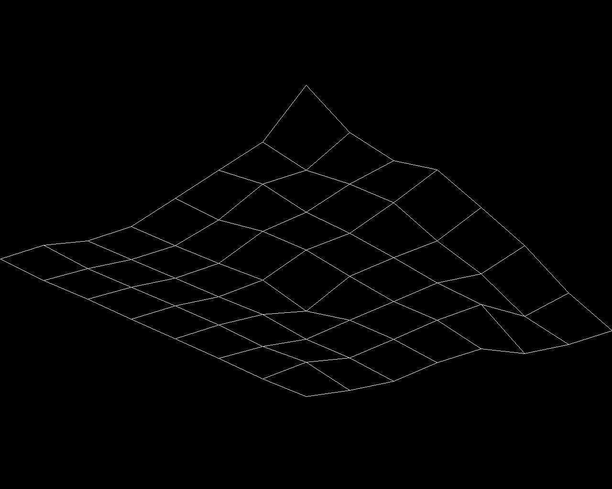

### Raise the terrain
##
### Description:
Generates a 7x7 grid with specified elevations on a file. This program runs in windows and was created on Visual Studio. The SDL2 config for windows was made following this [tutorial](https://www.youtube.com/watch?v=Sfn7yOiwJLw).

### Usage:
Execute with `terrain.exe file`\
The generated terrain can be rotated using the left and right arrows on the keyboard.\
To exit the program, press the `Esc` key.
##

The files [file.txt](file.txt), [file2.txt](file2.txt), and [file3.txt](file3.txt) are examples that can be used with the program to test it.

##

Using `terrain.exe file.txt` will give this output:\
\

